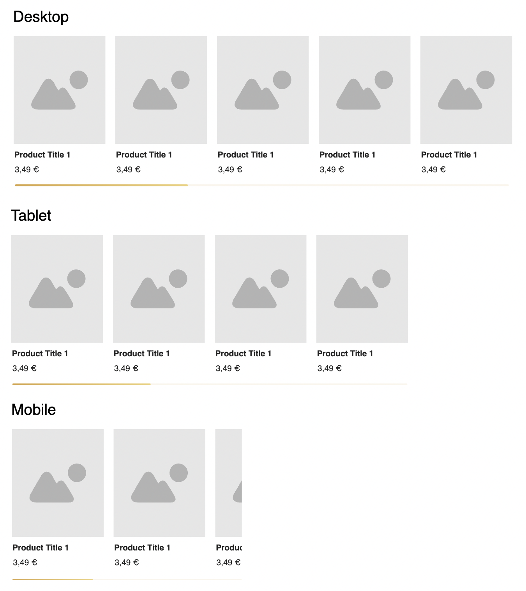

## Komponenten bauen in einem statischen Kontext

unter `/api/products/de-de` bekommst du eine liste von produkten. du kannst den request über query-params modifizieren:

- `hpp=5` sorgt dafür, dass du insgesamt 5 hits-per-page zurück gekommst
- `page=2` kann die aktuelle page festlegen (startet bei 0)

baue unter der route `/` einen product-slider wie hier:

das design ist mir egal und darauf lege ich keinen wert. du kannst hier selber entscheiden wie detailiert du das angehen willst. z.b könntest du folgende features hinzufügen:

- der initiale slider soll bereits statisch gerendert werden können
- es werden nicht alle produkte auf einmal dargestellt, sonder es wird nachgefetched wenn der user weiter scrolled
- es gibt einen custom scroll-indicator
- ...

überleg dir ein paar features (du musst nicht die obigen nehmen). mir geht es hier vor allem darum ein gefühl zu bekommen wie tief die verständnis für gatsby, typescript und react hast

## Software-Architektur

unter `config/de-de/index.ts` und `config/en-us/index.ts` liegen die länderspeziefischen Konfigurationen. da die liste der länder und die Größe jeder config-datei schnell sehr groß werden kann macht es keinen sinn, alle Konfigurationen in jede land zu laden. statdessen soll eine technik entwickelt werden, welche nur die jeweilige länderkonfig läd und möglichst einfach von jeder komponente aus importiert werden kann. hier soll es am schluss 4 scripts geben:

- `npm run start:de-de` startet die app mit der deutschen config
- `npm run start:en-us` startet den shop mit der englischen config
- `npm run build:de-de` baut die app mit der deutschen config
- `npm run build:en-us` baut den shop mit der englischen config

## Think-outside-the-box

Jedes Produkt hat einen b2b und einen b2c preis. wie könnte man am besten einen b2b/b2c toggle in die UI einbauen welcher bei klick die korrekten preise anzeigt. Evt sogar dass es auf eine statische weiße funktioniert (wenn ich den browser reloade soll bereits beim initialen laden das richtige angezeigt werden)
